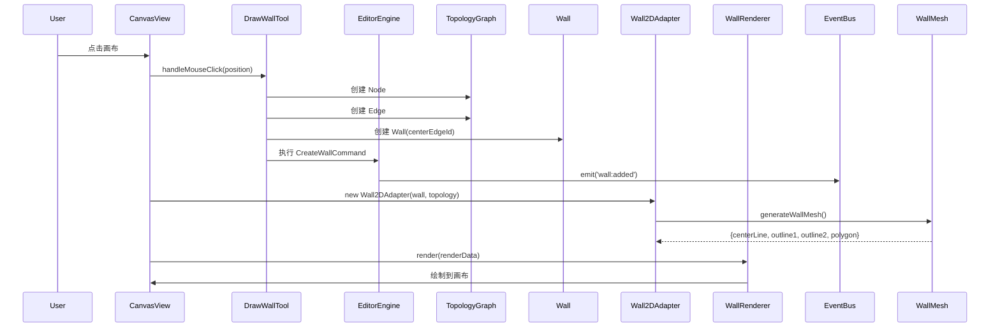

# 架构文档

## 系统架构图

```mermaid
graph TB
    subgraph UI["UI 层 (packages/housedesign-ui)"]
        App[App.vue]
        CanvasView[CanvasView.vue]
        Toolbar[Toolbar.vue]
        PropertyPanel[PropertyPanel.vue]
        EditorStore[editorStore]
        ConfigStore[configStore]
    end
    
    subgraph Core["Core 层 (packages/housedesign-core)"]
        subgraph CoreModels["core/model - 领域模型"]
            Wall[Wall]
            Room[Room]
            Opening[Opening]
        end
        
        subgraph CoreTopology["core/topology - 拓扑图"]
            Node[Node]
            Edge[Edge]
            HalfEdge[HalfEdge]
            Face[Face]
            TopologyGraph[TopologyGraph]
        end
        
        subgraph CoreGeometry["core/geometry - 纯几何"]
            Vec2[Vec2]
            Line[Line]
            Polygon[Polygon]
        end
        
        subgraph CoreKernel["core/kernel - 几何内核"]
            WallMesh[WallMesh]
            MiterJoin[MiterJoin]
            TrimExtend[TrimExtend]
            RoomDetection[RoomDetection]
        end
        
        subgraph Systems["systems/ - 编辑器系统"]
            SnapEngine[SnapEngine]
            CommandSystem[Command System]
            UndoRedo[UndoRedo]
            Serializer[Serializer]
        end
        
        subgraph Editor["editor/ - 编辑器协调"]
            EditorEngine[EditorEngine]
            ToolManager[ToolManager]
            EventBus[EventBus]
            SelectionManager[SelectionManager]
        end
        
        subgraph Canvas2D["canvas2d/ - 2D 视图"]
            Wall2DAdapter[Wall2DAdapter]
            WallRenderer[WallRenderer]
            DrawWallTool[DrawWallTool]
        end
        
        subgraph Config["config/ - 配置"]
            DefaultConfig[defaultRenderConfig]
        end
    end
    
    App --> CanvasView
    App --> Toolbar
    App --> PropertyPanel
    CanvasView --> EditorStore
    CanvasView --> ConfigStore
    Toolbar --> EditorStore
    PropertyPanel --> EditorStore
    
    EditorStore --> EditorEngine
    ConfigStore --> DefaultConfig
    
    EditorEngine --> Wall
    EditorEngine --> Room
    EditorEngine --> TopologyGraph
    EditorEngine --> SnapEngine
    EditorEngine --> UndoRedo
    EditorEngine --> ToolManager
    EditorEngine --> EventBus
    
    Wall --> Edge
    TopologyGraph --> Node
    TopologyGraph --> Edge
    
    Wall2DAdapter --> Wall
    Wall2DAdapter --> TopologyGraph
    Wall2DAdapter --> WallMesh
    
    WallMesh --> Vec2
    WallMesh --> Line
    MiterJoin --> Vec2
    
    DrawWallTool --> EditorEngine
    DrawWallTool --> CommandSystem
    
    WallRenderer --> Wall2DAdapter
    
    CanvasView --> Wall2DAdapter
    CanvasView --> WallRenderer
    CanvasView --> DrawWallTool
```



## 数据流

### 绘制墙体流程



## 核心概念

### 1. 领域模型 (Domain Model)

领域模型是纯数据结构，只包含业务实体的本质属性，不包含任何渲染逻辑：

```typescript
class Wall {
  id: string;
  centerEdgeId: string;      // 中心线 Edge ID
  outline1EdgeId?: string;   // 轮廓线1 Edge ID
  outline2EdgeId?: string;   // 轮廓线2 Edge ID
  thickness: number;         // 厚度
  height: number;            // 高度
  style: WallStyle;          // 样式
  openings: string[];        // 开口 ID 列表
}
```

### 2. 拓扑图 (Topology Graph)

使用图结构管理几何关系：

- **Node**: 节点（墙体端点）
- **Edge**: 有向边（连接两个节点）
- **HalfEdge**: 半边结构（用于面的环形表示）
- **Face**: 面（房间的拓扑表示）

### 3. 适配器模式 (Adapter Pattern)

将领域模型转换为渲染数据，实现关注点分离：

```typescript
class Wall2DAdapter {
  constructor(
    private wall: Wall,
    private topology: TopologyGraph
  ) {}
  
  getRenderData(): Wall2DRenderData {
    const centerEdge = this.topology.getEdge(this.wall.centerEdgeId);
    const startNode = this.topology.getNode(centerEdge.startNodeId);
    const endNode = this.topology.getNode(centerEdge.endNodeId);
    
    const mesh = generateWallMesh(
      startNode.position,
      endNode.position,
      this.wall.thickness
    );
    
    return {
      centerLine: mesh.centerLine,
      outline1: mesh.outline1,
      outline2: mesh.outline2,
      polygon: mesh.polygon
    };
  }
}
```

### 4. 命令模式 (Command Pattern)

所有修改操作通过命令执行，支持撤销/重做：

```typescript
class CreateWallCommand extends BaseCommand {
  execute() { /* 创建墙体 */ }
  undo() { /* 撤销创建 */ }
  redo() { /* 重做创建 */ }
}

editorEngine.undoRedo.execute(new CreateWallCommand(...));
```

### 5. 事件总线 (Event Bus)

解耦组件间通信：

```typescript
eventBus.on('wall:added', (wall) => { /* 处理墙体添加 */ });
eventBus.emit('wall:added', wall);
```

## 配置系统

### 默认配置 (Core)

```typescript
// packages/housedesign-core/src/config/defaultRenderConfig.ts
export const defaultRenderConfig = {
  wall: {
    fillColor: '#E8E8E8',
    centerLineColor: '#FF0000',
    centerLineStyle: 'dashed',
    outlineColor: '#000000',
    outlineWidth: 2
  },
  node: {
    radius: 5,
    fillColor: '#0066FF',
    strokeColor: '#FFFFFF'
  },
  grid: {
    color: '#CCCCCC',
    size: 100
  }
};
```

### 用户配置 (UI)

```json
// packages/housedesign-ui/src/config/customRenderConfig.json
{
  "wall": {
    "fillColor": "#F0F0F0"
  },
  "grid": {
    "size": 50
  }
}
```

### 运行时合并

```typescript
const finalConfig = mergeRenderConfig(defaultRenderConfig, customConfig);
```

## 扩展指南

### 添加新的几何算法

1. 在 `core/kernel/` 添加算法实现
2. 使用 `core/geometry/` 的纯数学函数
3. 导出到 `core/kernel/index.ts`

### 添加新的编辑器系统

1. 在 `systems/` 创建新目录
2. 实现系统逻辑
3. 在 `EditorEngine` 中集成

### 支持 3D 渲染

1. 实现 `canvas3d/adapters/Wall3DAdapter.ts`
2. 实现 `canvas3d/renderer/Renderer3D.ts`（可使用 Three.js）
3. 在 UI 中添加 3D 视图组件

## 性能优化

- **适配器缓存**：`Wall2DAdapter` 缓存渲染数据，避免重复计算
- **增量更新**：只重新渲染变化的部分
- **空间索引**：拓扑图支持快速查找节点和边
- **命令批处理**：支持批量执行命令

## 测试策略

- **单元测试**：测试 Core 层的纯函数和算法
- **集成测试**：测试编辑器系统的协作
- **E2E 测试**：使用 Playwright 测试完整用户流程

## 未来规划

- [ ] 3D 视图支持（Three.js）
- [ ] 约束求解器完整实现
- [ ] 房间自动检测
- [ ] 墙体修剪和延伸
- [ ] 门窗开口支持
- [ ] 材质和纹理系统
- [ ] 导出到 DWG/IFC 格式
- [ ] 多人协作编辑
